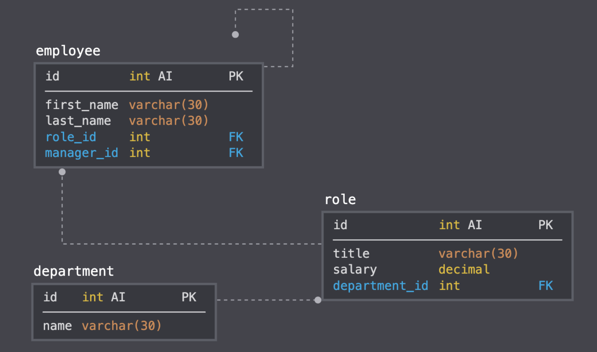

# employee-tracker

](https://badge.fury.io/js/cli)
](https://badge.fury.io/js/lodash)

### Description
* A command line application that allows the user to view, add, update, remove the employee, role and department of the company that uses MySQl database
* Database schema containing three tables: 

      1. employee
      2. role
      3. department
* Use the Inquirer npm package to prompt the user for CRUD(CREATE,READ,UPDATE,DELETE)the employee roles. 
* For instance, an employee should have firstname,lastname,role of the employee,department of the employee,manager of the employee and salary
### Table Schema

### Installation
Steps to install the node npm packages

* npm i
### Dependencies
* lodash
* inquirer
* mysql

Note: They already included in npm package.json
### Usage
`git clone git@https://github.com/Anitha-Venkatesan/employee-tracker.git`

`cd employee-tracker`

Open employee-tracker-connectionDB.js in Command Line Terminal using the command `node employee-tracker-connectionDB.js`

### Screenshots
* View All employee 
* 
* Add Role Department
* 
* Update/Remove Employee
* 

### References
* https://lodash.com/docs/4.17.15#map
* https://sqlbolt.com/lesson/select_queries_introduction
* https://www.w3schools.com/sql/sql_join.asp
* https://javascript.info/async-await
